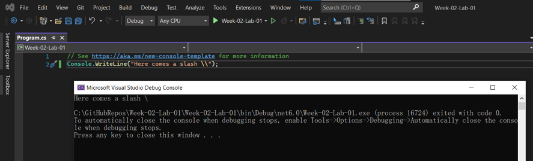
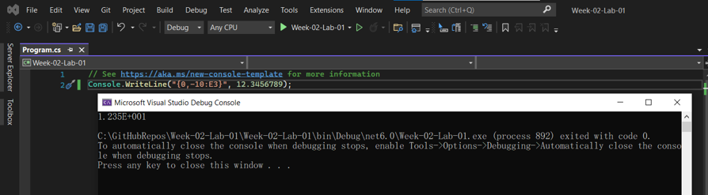

# Lab-01  Part 8  การกำหนดรูปแบบพร้อมความกว้างของทศนิยมของอาร์กิวเมนต์

👉 แก้โปรแกรมตามรูปด้านล่างนี้
```csharp
const double i = 123.456789d;
Console.WriteLine("{0:F1}", i);
Console.WriteLine("{0:F2}", i);
Console.WriteLine("{0:F3}", i);
Console.WriteLine("{0:F4}", i);
Console.WriteLine("{0:F5}", i);
```
➢ รันโปรแกรมและบันทึกผล


## ❔ แบบฝึกหัด จงรันโปรแกรมและบันทึกภาพ output ของบรรทัดคำสั่งต่อไปนี้

``` csharp
1. string name = "Hello";
    Console.WriteLine(String.Format("{0} there. I said {0}! {0}???", name));
```


``` csharp
2. Console.WriteLine("{2:d} {0:d} {1:d}", 1, 2, 3);
```


``` csharp
3. Console.WriteLine("Hello " + "World");
```


``` csharp
4. Console.WriteLine("Here comes a slash \\");
```


``` csharp
5. Console.WriteLine("|{0, 10}|", 999);
```


``` csharp
6. Console.WriteLine("|{0,-10}|", 000);
```


``` csharp
7. Console.WriteLine("The value: {0}.", 500);
```


``` csharp
8. Console.WriteLine("The value: {0:C}.", 500);
```


``` csharp
9. Console.WriteLine("{0,-10:F4}", 12.3456789);
```


``` csharp
10. Console.WriteLine("{0,-10:C}", 12.3456789);
```


``` csharp
11. Console.WriteLine("{0,-10:E3}", 12.3456789);
```


``` csharp
12. Console.WriteLine("{0,-10:x}", 65535);  // (x = lower case)
```


``` csharp
13. Console.WriteLine("{0,-10:X}", 65535);  // (X = upper case)
```


``` csharp
14. int i;
    Console.WriteLine("Value\tSquared\tCubed");
    for(i = 1; i < 10; i++)
        Console.WriteLine("{0}\t{1}\t{2}", i, i*i, i*i*i);
```


``` csharp
15. Console.WriteLine("{0:#.###}.", 1234.56789);
```


## [การใช้งานคำสั่ง Console.Read() และ Console.ReadLine()](./Lab-01-part-9-12.md)