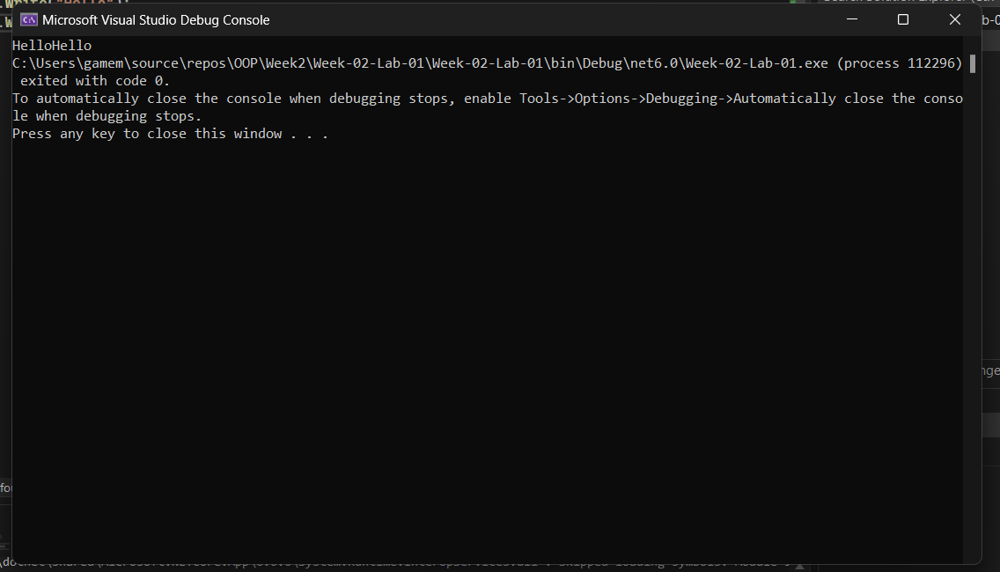
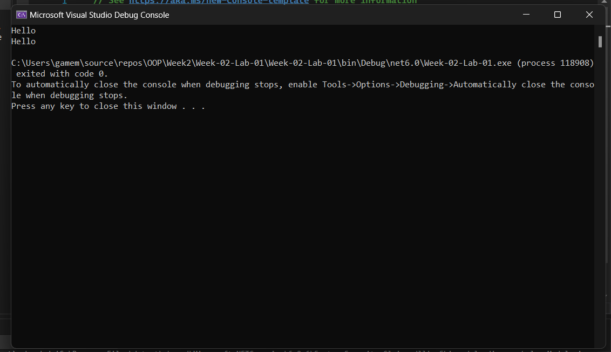
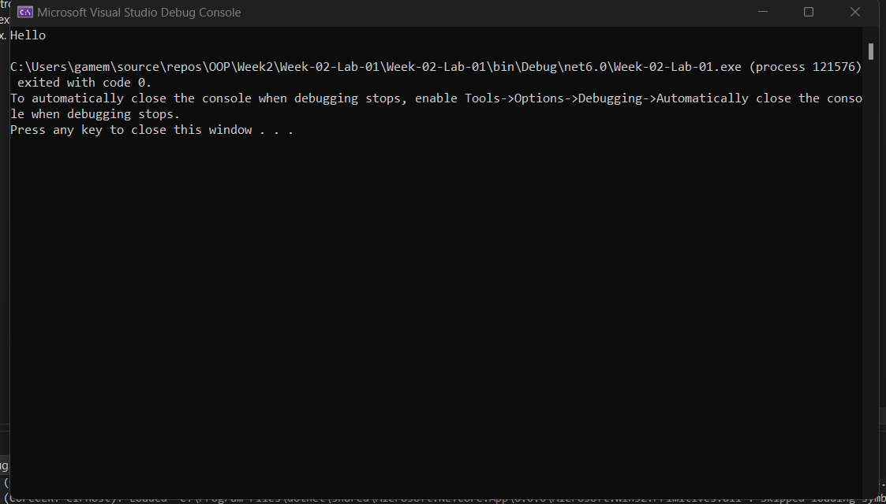
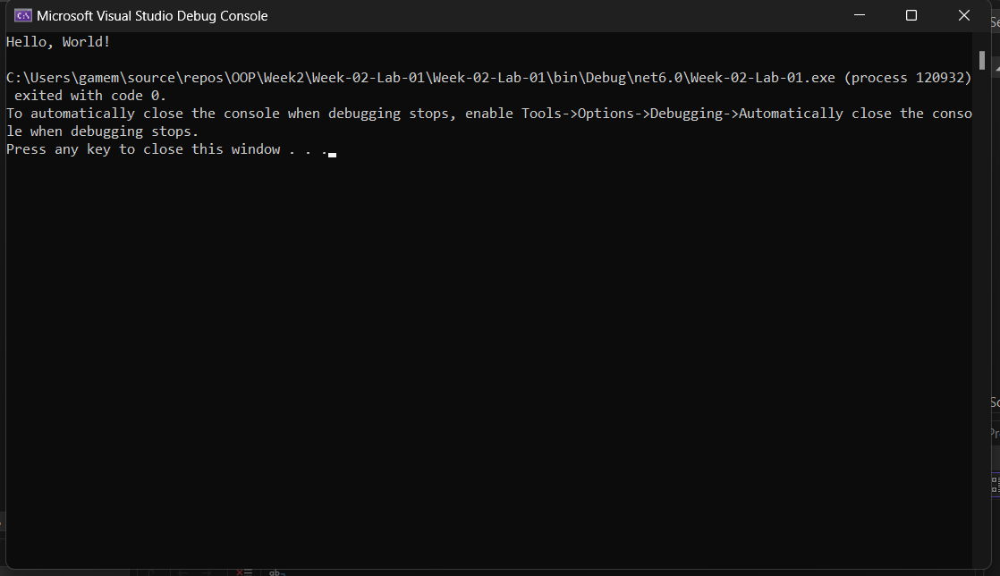

# Lab-01 Part 2~3 คำสั่ง Console.Write() และ Console.WriteLine()

## 2. การใช้เมดธอด Console.Write()

### 2.1 การใช้เมดธอด Console.Write()
👉 แก้ไขโปรแกรม ให้เป็นดังด้านล่างนี้

```csharp
Console.Write("Hello");
Console.Write("Hello");
```

➢ รันโปรแกรมและบันทึกผล



จากรูป โปรแกรมสามารถรันได้ เหก่ดวสฟกหา่เวกฟเาส

❔ ผลที่ได้จากการทดลอง เป็นอย่างที่นักศึกษาคิดหรือไม่ อย่างไร จงอธิบาย

### 2.2 การใช้เมดธอด Console.Write() ร่วมกับ  `Environment.NewLine`

`Environment.NewLine` เป็นค่าคงที่ที่ถูกนิยามในภาษา C# เพื่อใช้สำหรับการส่งอักขระขึ้นบรรทัดใหม่ไปยัง console

👉 แก้ไขโปรแกรม ให้เป็นดังด้านล่างนี้

```csharp
Console.Write("Hello" + Environment.NewLine);
Console.Write("Hello" + Environment.NewLine);
```

➢ รันโปรแกรมและบันทึกผล



❔ ผลที่ได้จากการทดลอง เป็นอย่างที่นักศึกษาคิดหรือไม่ อย่างไร จงอธิบาย
```
เป็นไปอย่างที่คิดแสงข้อความ Hello คนละบรรทัด
```

## 3. เมดธอด Console.WriteLine()

`Console.WriteLine()` เป็นคำสั่งที่เทียบเท่ากับการใช้  `Console.Write` ร่วมกับ  `Environment.NewLine` ทำให้ประหยัดเวลาในการเขียนโปรแกรม
👉 แก้โปรแกรมในเมดธอด Main() ให้เป็นดังต่อไปนี้

```csharp
Console.WriteLine("Hello");
```

➢ รันโปรแกรมและบันทึกผล



👉 แก้ไขโปรแกรม ให้เป็นดังรูปด้านล่างนี้

```csharp
Console.Write("Hello, ");
Console.WriteLine("World!");
```

➢ รันโปรแกรมและบันทึกผล

❔ ผลที่ได้จากการทดลอง เป็นอย่างที่นักศึกษาคิดหรือไม่ อย่างไร จงอธิบาย
```
ไม่เป็นเหมือนที่คิดไว้ Console.Write("Hello, ");
Console.WriteLine("World!"); จะแสดงผลบรรทัดเดียวกันจะต่อประโยคช่องว่าง
```
❔ จงอธิบายความแตกต่างระหว่างคำสั่ง Console.Write() และ Console.WriteLine()
```
Console.Write() เมื่อเขียน Input Output จะเขียนบรรทัดเดียวกัน
Console.WriteLine เมื่อเขียน Input หรือแสดง Output จะอยู่บรรทัดถัดไป
```
## [4. จำนวนของอาร์กิวเมนต์ในคำสั่ง Console.WriteLine()](./Lab-01-part-4.md)
