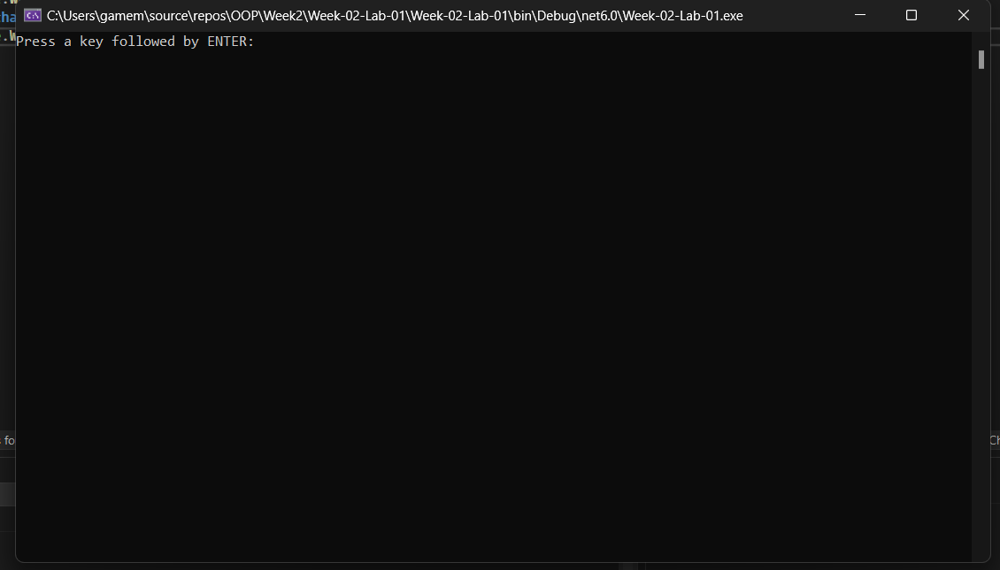
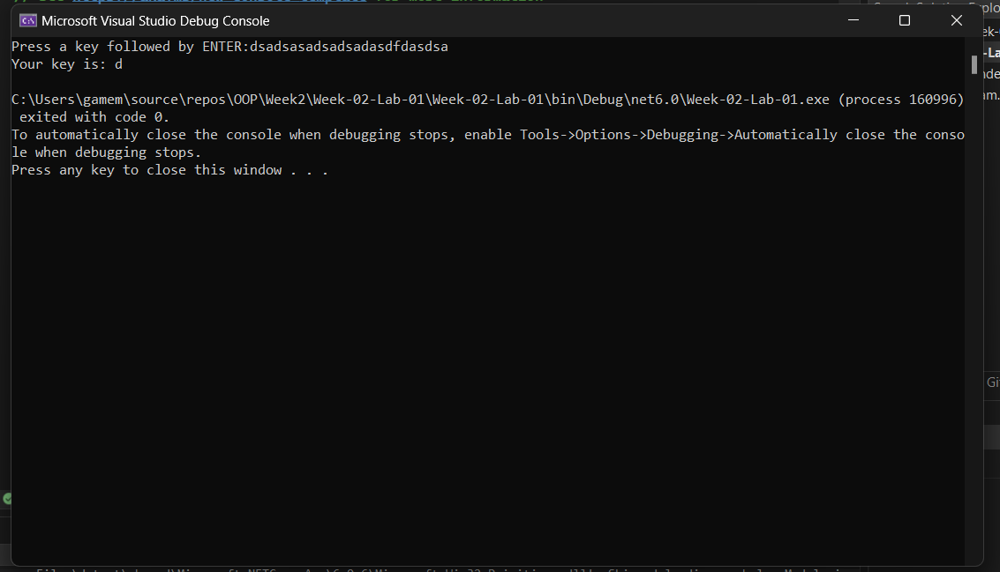
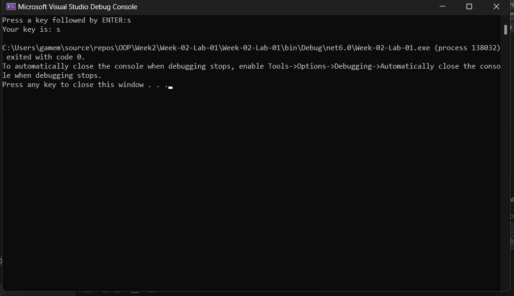
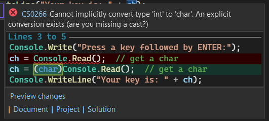
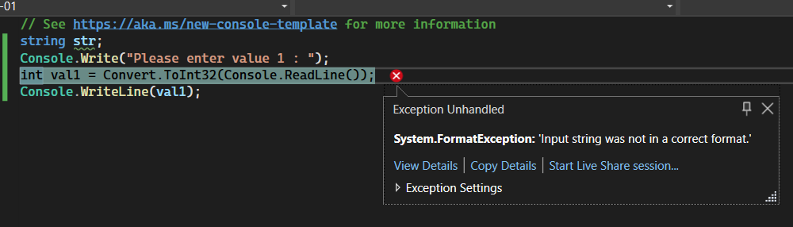
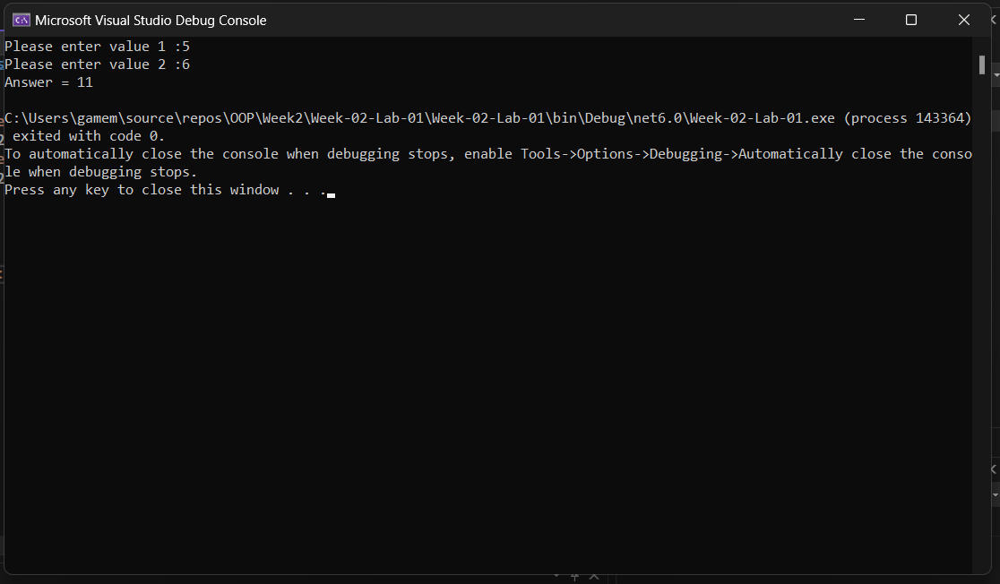
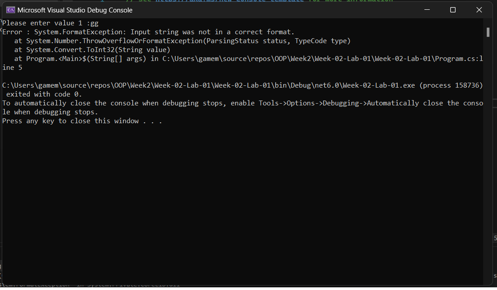
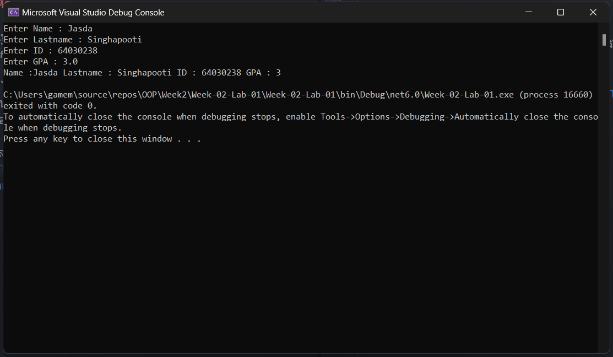
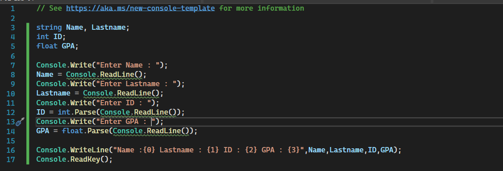

# Lab-01 การใช้งานคำสั่ง Console.Read() และ Console.ReadLine()
### ความรู้เบื้องต้น

คำสั่งที่ใช้รับค่าตัวอักษรทางอินพุตมาตรฐานของ C# คือ Console.Read() และ Console.ReadLine() โดยทั้งสองจะมีข้อแตกต่างกันคือ Read() จะอ่านตัวอักษร ส่วน ReadLine() จะอ่านสตริงจนกว่าจะกด Enter ในการรับค่าด้วย Read() และ ReadLine() จะรับเฉพาะค่า ASCII เท่านั้น หากต้องการรับค่าตัวเลข จะต้องมีการแปลง ASCII ของตัวเลขที่พิมพ์เข้ามาให้เป็นค่าตัวเลข เช่นในการรับอักษร “22” จะไม่ได้หมายถึงค่าตัวเลข 22

## 9. การรับตัวอักษรจากคีย์บอร์ด

👉 แก้ไขโปรแกรมให้เป็นดังรูป

```csharp
char ch;
Console.Write("Press a key followed by ENTER:");
ch = (char)Console.Read();  // get a char
Console.WriteLine("Your key is: "+ch);
```

➢ รันโปรแกรมและบันทึกผล


❔ ถ้าพิมพ์ตัวอักษรจำนวนหลายๆ ตัวแล้วกด Enter จะได้ผลอย่างไร ทำไมจึงเป็นเช่นนั้น


❔ ในบรรทัดซึ่งมีโปรแกรมเป็น ch = (char)Console.Read(); นั้น ถ้าตัด (char) ออกไป จะเกิดอะไรขึ้น ให้อธิบายประกอบ


```
จะมีข้อความแจ้งเตือนว่า ให้เลือกประเภทของข้อมูลว่าเป็๋น int หรือ char เมื่อรันโปรแกรมจะมี Error แต่โปรแกรมก็สามารถทำงานได้ 
```
## 10. การรับ string จากคีย์บอร์ด

👉 แก้ไขโปรแกรมให้เป็นดังรูป

```csharp
string str;
Console.Write("Enter some characters.");
str = Console.Read();
Console.WriteLine("You entered: "+str);
```

➢ รันโปรแกรมและบันทึกผล

## 11. การรับค่าตัวเลขจากคีย์บอร์ด

เนื่องจากคำสั่ง Read() และ ReadLine() จะรับเฉพาะตัวอักษร การรับตัวเลข เราต้องใช้เมธอด TryParse() มาช่วยแปลงค่า

👉 แก้ไขโปรแกรมให้เป็นดังรูป

```csharp
string str;
Console.Write("Please enter value 1 : ");
int val1 = Convert.ToInt32(Console.ReadLine());
Console.WriteLine(val1);
```

➢ รันโปรแกรม โดยป้อนตัวเลขใดๆ และบันทึกผลที่ได้


❔ ถ้าเราป้อนตัวอักษรลงไปแทนที่ตัวเลข จะเกิดอะไรขึ้น มีวิธีการป้องกันหรือแก้ไขอย่างไร

```
จะเกิด Error ไม่อินพุตไม่ถูกต้อง
```
## 12. การรับค่าตัวเลขจากคีย์บอร์ด (ป้องกันโดยใช้ประโยค try{…} catch{…})

ในบางกรณีที่ผู้ใช้ป้อนตัวอักษร จะทำให้เกิด error และทำให้โปรแกรม hang ได้ จึงต้องมีการป้องกันโดยใช้ประโยค `try{…}` `catch{…}` (ประโยค `try{…}` `catch{…}`   นี้จะศึกษารายละเอียดภายหลัง)

👉 แก้ไขโปรแกรมให้เป็นดังรูป

```csharp
try
{
    Console.Write("Please enter value 1 :");
    int val1 = Convert.ToInt32(Console.ReadLine());
    Console.Write("Please enter value 2 :");
    int val2 = Convert.ToInt32(Console.ReadLine());
    Console.WriteLine("Answer = " + (val1 + val2));
}
catch (Exception e)
{
    Console.WriteLine("Error : " + e.ToString());
}
```

➢ รันโปรแกรม โดยป้อนตัวเลขใดๆ และบันทึกผล


❔ ถ้าเราป้อนตัวอักษรลงไปแทนที่ตัวเลข จะเกิดอะไรขึ้น เหมือนหรือต่างจากโปรแกรมก่อนหน้านี้อย่างไร


## 📝 แบบฝึกหัด

ให้เขียน code ในการรับค่าอินพุตต่อไปนี้และแสดงออกหน้าจอให้ถูกต้อง Name : (ป้อนชื่อของนักศึกษา)

``Lastname :`` (ป้อนนามสกุลนักศึกษา)  
``ID :`` (ป้อนรหัสนักศึกษา)  
``GPA :`` (ป้อนเกรดเฉลี่ยนักศึกษา โดยมีทศนิยมสองหลัก)  

➢ รันโปรแกรมและบันทึกผล


## [การตั้งชื่อตัวแปรและชนิดข้อมูลในภาษา C\#](./Lab-01-part-13.md)