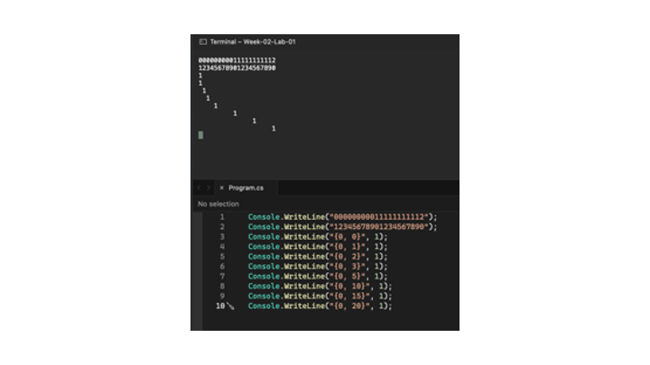
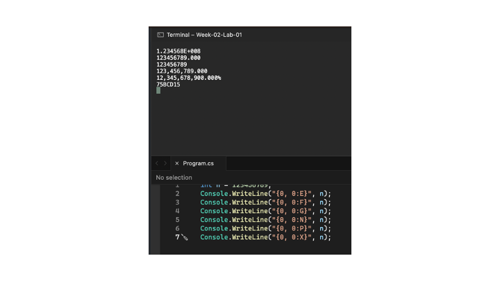
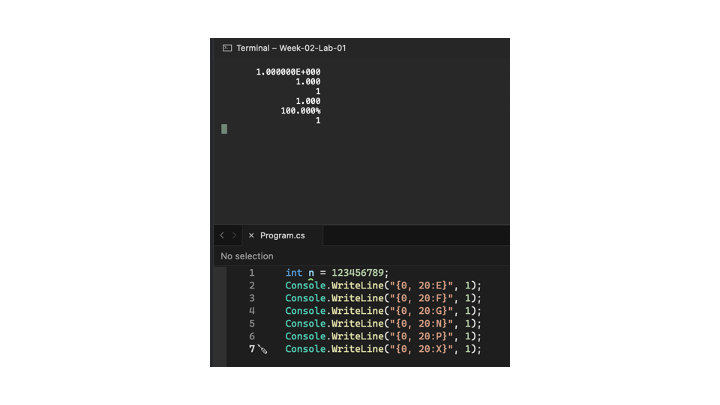

# Lab-01 Part 5 การกำหนดความกว้างของอาร์กิวเมนต์

เราสามารถแกหนดตำแหน่งของอักขระที่จะพิม์ออกทาง output ได้ โดยการใช้รูปแบบ { i, j }
โดย i ยังคงเป็นลำดับที่ตามตำแหน่งของ place holder และ j คือจำนวนช่องว่างทีต้องการ

👉แก้โปรแกรมตามรูปด้านล่างนี้

```csharp
Console.WriteLine("00000000011111111112");
Console.WriteLine("12345678901234567890");
Console.WriteLine("{0, 0}", 1);
Console.WriteLine("{0, 1}", 1);
Console.WriteLine("{0, 2}", 1);
Console.WriteLine("{0, 3}", 1);
Console.WriteLine("{0, 5}", 1);
Console.WriteLine("{0, 10}", 1);
Console.WriteLine("{0, 15}", 1);
Console.WriteLine("{0, 20}", 1);
```

หมายเหตุ ตัวเลขสองบรรทัดบนสุด ใช้เพื่อกำหนดตำแหน่ง column ของตัวอักษร

➢ รันโปรแกรมและบันทึกผล<br>


 
❔ การกำหนดความกว้างของอาร์กิวเมนต์ด้วยเครื่องหมาย { , } ในคำสั่ง ``Console.WriteLine()`` มีรูปแบบการใช้งานอย่างไร

- ค่าในปีกการ { , } ตัวแรกหมายถึงลำดับที่ต้องการแสดงค่าตัวแปรหรือตัวเลข ตัวที่สองหมายถึงตำแหน่งที่ต้องการวางตัวเลขในค่าตัวแรก


## 6. การกำหนดรูปแบบของอาร์กิวเมนต์

👉 แก้โปรแกรมตามรูปด้านล่างนี้

```csharp
int n = 123456789;
Console.WriteLine("{0, 0:E}", n);
Console.WriteLine("{0, 0:F}", n);
Console.WriteLine("{0, 0:G}", n);
Console.WriteLine("{0, 0:N}", n);
Console.WriteLine("{0, 0:P}", n);
Console.WriteLine("{0, 0:X}", n);
```

➢ รันโปรแกรมและบันทึกผล<br>


❔  การกำหนดตัวอักษร E, F, G, N, P, X หมายถึงให้พิมพ์ออกมาเป็นอะไร

- หมายถึงการพิมพ์ข้อความออกมาเป็นรูปแบบ จำนวนเต็ม ทศนิยม เปอร์เซ็น เลขฐาน 16 เป็นต้น
 

## 7. การกำหนดรูปแบบพร้อมความกว้างของอาร์กิวเมนต์

👉 แก้โปรแกรมตามรูปด้านล่างนี้

```csharp
int n = 123456789;
Console.WriteLine("{0, 20:E}", 1);
Console.WriteLine("{0, 20:F}", 1);
Console.WriteLine("{0, 20:G}", 1);
Console.WriteLine("{0, 20:N}", 1);
Console.WriteLine("{0, 20:P}", 1);
Console.WriteLine("{0, 20:X}", 1);
```

➢ รันโปรแกรมและบันทึกผล<br>

 
## [Part 8  การกำหนดรูปแบบพร้อมความกว้างของทศนิยมของอาร์กิวเมนต์](./Lab-01-part-8.md)