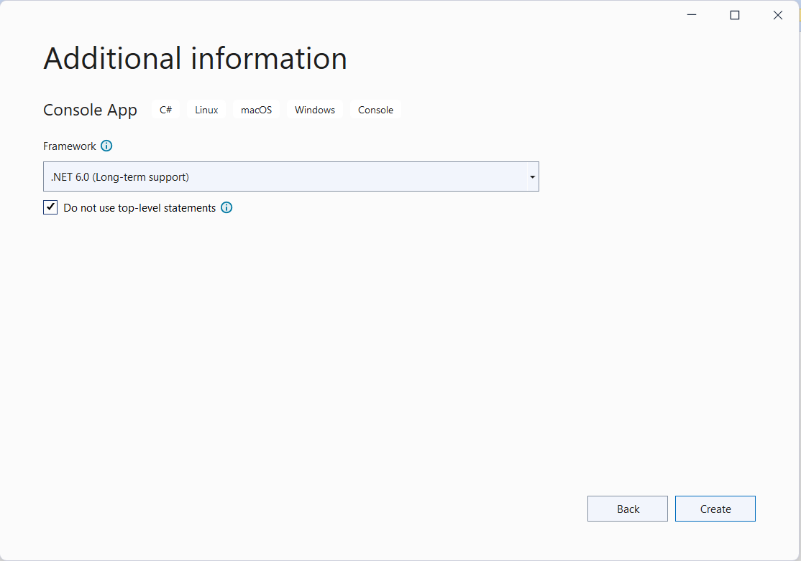

 # LAB-01 C# Console program

## รูปแบบของการเขียน code ที่เปลี่ยนไปใน C# .NET 6 
การเขียนโปรแกรมด้วยภาษา C# ใน .NET 6 จะมีสิ่งที่เปลี่ยนแปลงไปจาก .NET รุ่นก่อนหน้า นั่นคือมีการใช้ project template ตัวใหม่ในขณะที่สร้าง project
โดยรูปแบบเริ่มต้นนั้น  visual studio จะสร้าง code ดังนี้ให้ในไฟล์ Program.cs ของเรา

``` C#
// See https://aka.ms/new-console-template for more information
Console.WriteLine("Hello, World!");
```

ผลที่ได้จาการรันโปรแกรมจะยังคงเหมือนกับการใช้ code ต่อไปนี้ใน .NET 5 หรือรุ่นก่อน ๆ  

``` C#
using System;

namespace MyApp // Note: actual namespace depends on the project name.
{
    internal class Program
    {
        static void Main(string[] args)
        {
            Console.WriteLine("Hello World!");
        }
    }
}
```

โปรแกรมทั้งสองแบบข้างบน สามารถใช้ได้บน C# รุ่น 10.0 ขึ้นไป ดังนั้นเพื่อความกระชับในการเขียนโปรแกรม
เราก็อาจจะเลือกใช้  project template ตัวใหม่นี้ได้ เนื่องจาก compiler ของภาษา C# รุ่นใหม่ ๆ จะรองรับอยู่แล้ว


โดยสรุป ในการพัฒนาโปรแกรม เรามีสองตัวเลือกในการทำงานกับ .NET 6 ขึ้นไป นั่นคือ 

- ใช้รูปแบบโปรแกรมแบบใหม่ โดยเพิ่มคำสั่งระดับบนสุดใหม่เมื่อคุณเพิ่มคุณสมบัติ
- แปลงโปรแกรมแบบเป็นสไตล์เก่า โดยการเพิ่มคลาสเมธอด Main

สำหรับผู้ที่ต้องการเทมเพลตเดิม สามารถกำหนดได้จากการติ๊กตัวเลือก `Do not use top-level statements` ในขั้นตอนการสร้าง project ใหม่ ดังรูป




## การเขียนโปรแกรมภาษา C# ในรูปแบบใหม่

สิ่งที่ช่วยให้การเขียนโปรแกรมภาษา C#  ในรูปแบบใหม่เป็นไปได้คือ top-level statements, global using directives, และ implicit using directives

### top-level statements
ในการเขียนโปรแกรมในรูปแลลใหม่นี้  compiler จะสร้าง class และองค์ประกอบต่างๆ ของ method ใน main program ให้เราโดยอัตโนมัติ 
ซึ่งจะสังเกตุว่าใน C#  รุ่นก่อนๆ เราก็มักจะใช้ code ที่ Visual studio สร้างให้โดยไม่ไปแตะต้องมันสักเท่าใด เรามักจะสนใจเพียงแค่  code ที่เราต้องการเขียนเท่านั้น  
แต่สิ่งที่แตกต่างออกไปใน .NET 6 นี้ก็คือ compiler จะสร้าง class และเมธอด Main ในลักษณะ global namespace (ทุกอย่างที่เราเขียนเพิ่มลงไปใน code จะอยู่ภายใต้เมธอด Main)  

ในรูปแบบใหม่นี้ เราสามารถเขียน statements (ประโยคคำสั่ง) ในโปรแกรมได้ตามปกติ เพมือนที่เขียนใน Main ของโปรแกรมในรูปแบบเก่า 
สามารถเข้าถึงตัวแปร args ที่ส่งผ่านมาทาง command line ใช้คำสั่ง multithread จำพวก await และกำหนดค่า exit code เพื่อส่งกลับไปให้ผู้เรียกทาง command line ได้เหมือนเดิม

เราสามารถสร้าง function แต่มันจะเป็น function ที่ถูกสร้างภายใต้เมธอด Main (เรียกว่า neted function) 
แต่ไม่สามารถเพิ่ม access modifier (เช่น public หรือ protected) ให้กับ local function เหล่านั้นได้

### Implicit using directives
ในการเขียนโปรแกรมภาษา C# เราจำเป็นต้องพึ่งพา (reuse) องค์ประกอบ (components) ที่ผู้อื่นเขียนไว้บ้างแล้ว การนำ components เหล่านั้นมาใช้เราต้องใช้คำสัง using 
เมื่อมีการเปลี่ยนรูปแบบการเขียนโปรแกรมไปจากเดิม (ตัดส่วน top level ออกไป) ก็จะต้องเป็นหน้าที่ของ compiler ที่จะต้องประกาศ using แทนผู้เขียนโปรแกรม

สำหรับ console applications จะมีการกำหนด components เบื้องต้นให้ดังนี้  

using System;
using System.IO;
using System.Collections.Generic;
using System.Linq;
using System.Net.Http;
using System.Threading;
using System.Threading.Tasks;

สำหรับการสร้าง project ชนิดอื่น ๆ ก็จะมีการนำเข้า components ที่แตกต่างไปจาก console application

If you need using directives that aren't implicitly included, you can add them to the .cs file that contains top-level statements or to other .cs files. 
For using directives that you need in all of the .cs files in an application, use global using directives.