# Lab-01 การตั้งชื่อตัวแปรและชนิดข้อมูลในภาษา C\#


 ให้นักศึกษาพิจารณาชื่อตัวแปรตามตารางต่อไปนี้ ว่าสามารถใช้ได้หรือไม่ พร้อมบอกเหตุผล

| ชื่อตัวแปร | ใช้ได้/ไม่ได้ | เหตุผล|
|--|--|--|
| `xxx`     | ใช้ได้ | ไม่มีตัวอักษรที่ละเมิดกฎการตั้งชื่อ |
| `null` | | |
| `_value` | | |
| `First-name`| | |
| `Hello!` | | |
| `w*h` | | |
| `time` | | |
| `do` | | |
| `Do` | | |
| `21November`| | |
| `ladkrabang`| | |
| `Student ID`| | |


---ผลการทดลอง<br>
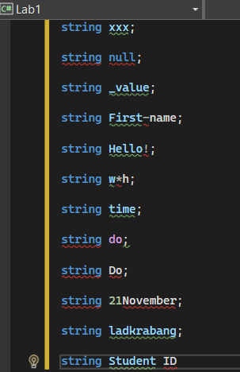


## ชนิดข้อมูลภายในภาษา C\#

Property ของชนิดข้อมูล ในภาษา C# มีชนิดข้อมูลต่างๆ ได้แก่ `byte`, `char`, `bool`, `sbyte`, `short`, `ushort`, `int` , `uint`, `float`, `double`, `decimal`, `long`, `ulong` โดยแต่ละชนิด มีคุณสมบัติที่สำคัญได้แก่ ขนาด (เป็นไบต์) ค่าต่ำสุด ค่าสูงสุด ที่เก็บในตัวแปรชนิดนั้นๆ ได้ ซึ่งมีฟังก์ชันในภาษา C# ที่ช่วยให้เราทราบคุณสมบัติเหล่านั้น ได้แก่คำสั่ง `sizeof()`, `MinValue()` และ `MaxValue()` การแสดงค่าคุณสมบัติต่างๆ ของตัวแปร สามารถทำได้โดยใช้ฟังก์ชั่นเหล่านั้น ดังตัวอย่าง

## 13. โปรแกรมแสดงคุณสมบัติ size, MinValue และ MaxValue ของชนิดข้อมูล

```csharp
Console.WriteLine("Data type : int");
Console.WriteLine("Size :" + sizeof(int));
Console.WriteLine("Minimum Value :" + int.MinValue);
Console.WriteLine("Maximum Value :" + int.MaxValue);
```

### ผลที่ได้จากโปรแกรม

```text
Data type : int
Size :4
Minimum Value :-2147483648
Maximum Value :2147483647
```

👉 คำสั่งสำหรับการทดลอง  

ให้นักศึกษา เขียนโปรแกรมคล้ายกับตัวอย่างในข้อ 13 โดยมีชนิดข้อมูลเป็น `byte`, `char`, `bool`, `sbyte`, `short`, `ushort`, `uint`, `float`, `double`, `decimal`, `long` `และ ulong`  

### หมายเหตุ

ชนิดข้อมูล bool เก็บข้อมูลได้เฉพาะ true และ false ไม่ต้องหา MinValue และ MaxValue

ชนิดข้อมูล char จะต้องมีการ cast ค่า MinValue และ MaxValue ไปยัง int ก่อน ดังนี้

```csharp
Console.WriteLine("Minimum Value :" + (int) char.MinValue);
Console.WriteLine("Maximum Value :" + (int) char.MaxValue);
```
---ผลการทดลอง `char`<br>
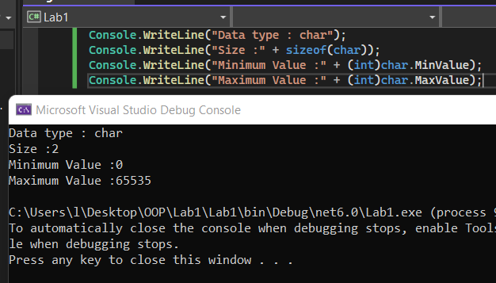

---ผลการทดลอง `byte`<br>
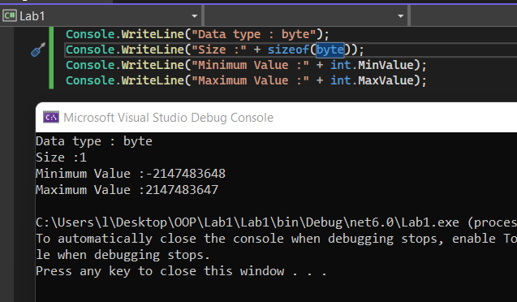
---ผลการทดลอง `short`<br>


---ผลการทดลอง `ushort`<br>
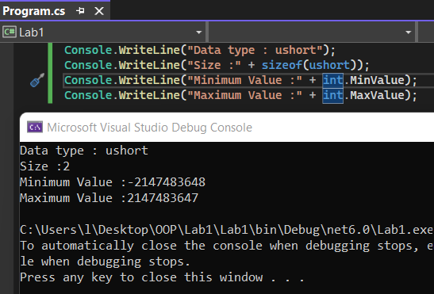
 

---ผลการทดลอง `uint`<br>
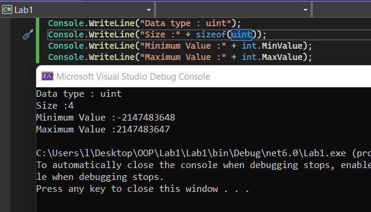
 

---ผลการทดลอง `float`<br>
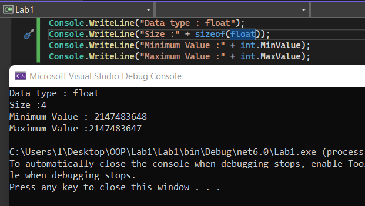

---ผลการทดลอง `double`<br>
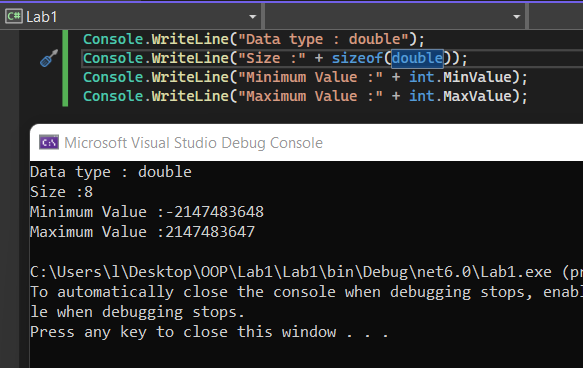
---ผลการทดลอง `decimal`<br>
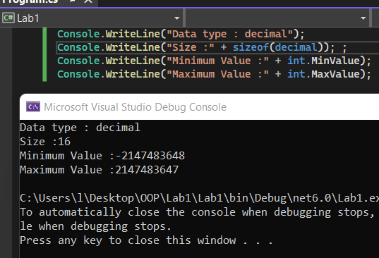
---ผลการทดลอง `long`<br>
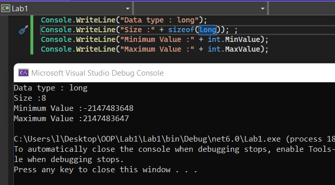

---ผลการทดลอง `ulong`<br>
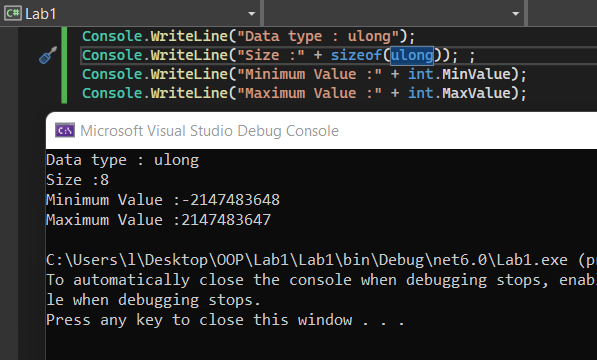

---ผลการทดลอง `bool`<br>
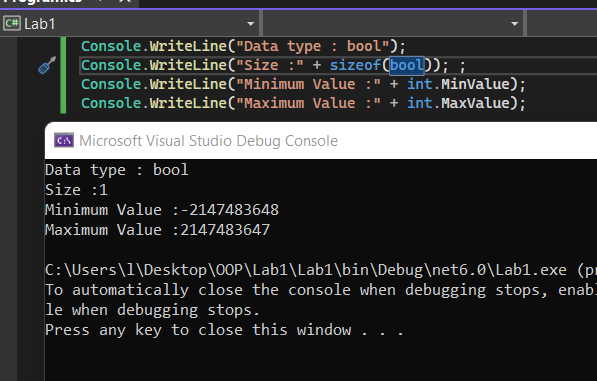
---ผลการทดลอง `sbyte`<br>
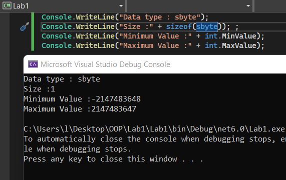

## การใช้งานข้อมูลชนิดต่างๆ

ข้อมูลชนิดตรรกะ The Boolean Type
ข้อมูลชนิดตรรกะ (boolean) มีค่าที่เป็นไปได้เพียง 2 ค่าเท่านั้นคือ true และ false ในภาษา C# จะไม่สามารถกำหนดค่าตัวเลขลงไปในตัวแปร boolean ได้ ส่วนใหญ่ตัวแปร boolean มักใช้เพื่อการตัดสินใจและมีที่มาจากการประเมินค่าสมการต่างๆ ตัวอย่างต่อไปนี้เป็นการใช้ตัวแปร boolean กับการเปรียบเทียบด้วยตัวดำเนินการ “>”
ตัวอย่าง

```csharp
bool a = 4 > 5;
Console.WriteLine("4 > 5 is {0}", a);
```

## สนุกกับการสร้างตัวเลขสุ่ม

ในภาษา C# มีวิธีการสร้างตัวเลขสุ่ม (random number) โดยใช้คลาส Random มาสร้างเป็นตัวแปรโดยมีรูปแบบดังนี้

```csharp
Random random = new Random();
```

เมื่อสร้างแล้ว เราสามารถนำมาหาค่าตัวเลขสุ่มจากตัวแปรดังกล่าว ซึ่งมักจะกำหนดค่าสูงสุดและต่ำสุดในการสุ่มลงไปด้วย ดังนี้

```csharp
int randomNumber = random.Next(0, 100);
```

โปรแกรมด้านล่างนี้เป็นตัวอย่างการสุ่มเลข 0 – 100

```csharp
Random random = new Random();
int randomNumber = random.Next(0, 100);
Console.WriteLine(randomNumber);
```
 
ให้รัน 10 ครั้งแล้วบันทึกค่าที่ได้จากการรัน


## [การเขียนโปรแกรมด้วยตัวดำเนินการทางตรรกะ](./Lab-01-part-14.md)
