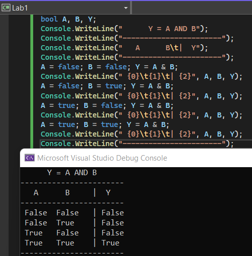
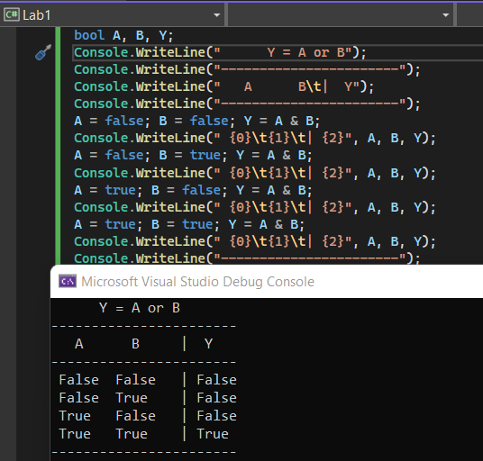
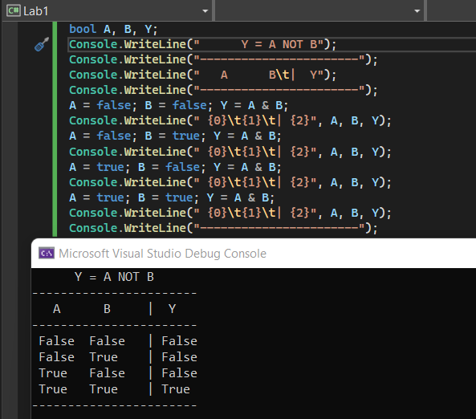
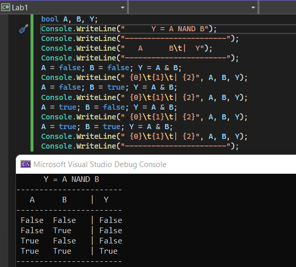
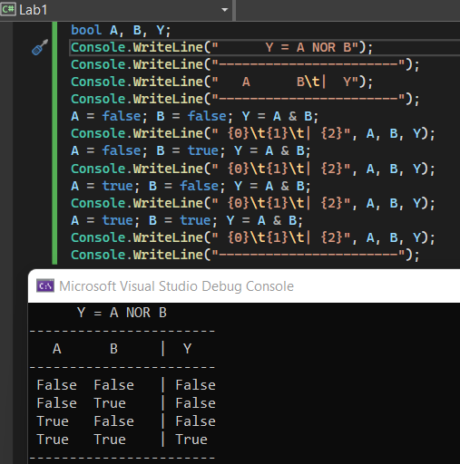
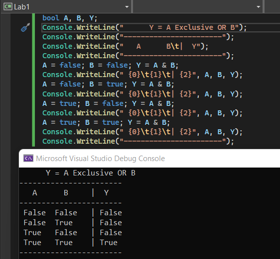

# Lab-01 การเขียนโปรแกรมด้วยตัวดำเนินการทางตรรกะ

ตัวแปรชนิด boolean มักจะถูกใช้เป็นที่เก็บผลที่เกิดจากการดำเนินการทางตรรกะ เช่น AND, OR, NOT เป็นต้น ซึ่งการดำเนินการทางตรรกะจะมีตารางความจริง เป็นตัวบอกผลในการดำเนินการของตัวดำเนินการต่างๆ ดังตัวย่าง

### ตัวดำเนินการ AND

Y = A AND B

| A | B | Y |
|---|---|---|
| 0 | 0 | 0 |
| 0 | 1 | 0 |
| 1 | 0 | 0 |
| 1 | 1 | 1 |

### ตัวดำเนินการ OR

Y = A OR B

| A | B | Y |
|---|---|---|
| 0 | 0 | 0 |
| 0 | 1 | 0 |
| 1 | 0 | 0 |
| 1 | 1 | 1 |

### ตัวดำเนินการ NOT

Y = NOT A

| A | Y |
|--|--|
| 0 | 1 |
| 1 | 0 |

ตัวดำเนินการในภาษา C#
ใช้เครื่องหมายต่างๆ ดังต่อไปนี้

| การดำเนินการ | เครื่องหมาย |
|------------|-----------|
| Logical AND | & |
| Logical XOR | ^ |
| Logical OR | \| |

## 14. การเขียนโปรแกรมด้วยตัวดำเนินการทางตรรกะ

ตัวอย่างภาษา C# ต่อไปนี้เป็นการพิมพ์ตารางความจริงออกทางหน้าจอ
👉 ให้เขียนโปรแกรมต่อไปนี้

```csharp
bool A, B,Y;
Console.WriteLine("      Y = A AND B");
Console.WriteLine("-----------------------");
Console.WriteLine("   A      B\t|  Y");
Console.WriteLine("-----------------------");
A = false; B = false; Y = A & B;
Console.WriteLine(" {0}\t{1}\t| {2}", A,B,Y);
A = false; B = true; Y = A & B;
Console.WriteLine(" {0}\t{1}\t| {2}", A, B, Y);
A = true; B = false; Y = A & B;
Console.WriteLine(" {0}\t{1}\t| {2}", A, B, Y);
A = true; B = true; Y = A & B;
Console.WriteLine(" {0}\t{1}\t| {2}", A, B, Y);
Console.WriteLine("-----------------------");
```

➢ รันโปรแกรมและบันทึกผล<br>

 
👷 จากจ้อ 14 ให้เขียนโปรแกรมเพื่อสร้างตารางความจริงของลอจิกดังต่อไปนี้

1. `AND`<br>

2. `OR`<br>

3. `NOT`<br>

4. `NAND`<br>

5. `NOR`<br>

6. `Exclusive OR`<br>



## [ชนิดข้อมูลตัวเลขจำนวนเต็ม (Integer Types)](./Lab-01-part-15.md)
